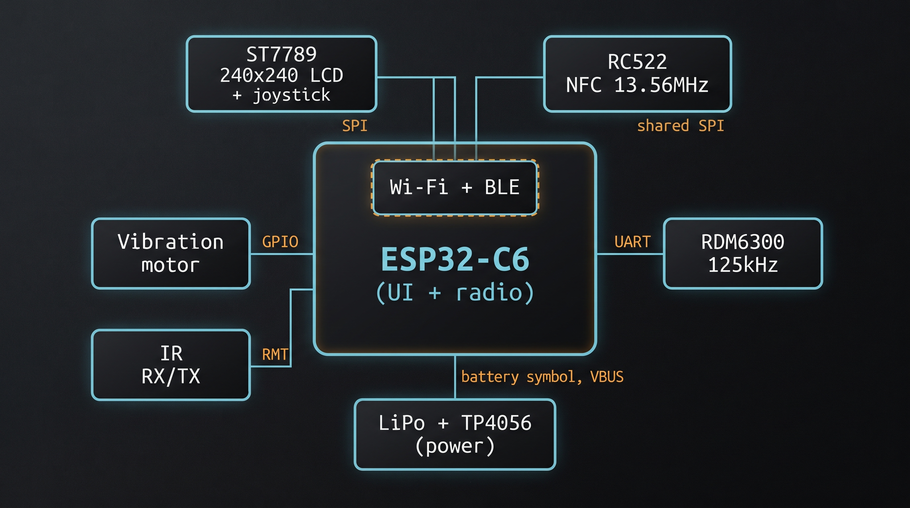

# Makeshift Flipper / EMAG

An open, single-MCU handheld for authorized, local hardware experiments.
One **ESP32-C6** runs everything: the interface and peripheral logic
(display, input, RFID/NFC, IR) plus its own Wi-Fi and passive Bluetooth
Low Energy radio.

> **Responsibility disclaimer:** The hardware and firmware in this
> repository are technically capable of more than the intended, authorized
> uses described below — that is true of any RFID reader, IR transceiver,
> or Wi-Fi/BLE radio, and no firmware control can fully prevent someone
> from repurposing what they hold in their hands. Nothing here grants
> permission to act beyond what the law and the target's owner allow. If
> you use this device — or code derived from it — to read, clone,
> transmit, or monitor something you do not own or are not explicitly
> authorized to test, that is your action and your legal responsibility
> alone. Neither the author(s) of this project nor any state or authority
> approves, endorses, or is responsible for unauthorized or unlawful use;
> building or owning this device does not authorize anything it is
> technically able to do.

> **Prototype status:** The firmware builds clean for the ESP32-C6 and has
> host-side logic tests, but the hardware has not yet been assembled — pin
> wiring, the shared SPI bus, the RIGHT-button/I2C-SDA sharing, and Wi-Fi+
> BLE coexistence still need real-hardware validation. Features described
> below are implemented scope, not claims of field-proven operation.

> **Single-MCU (C6-standalone) architecture:** the device used to be a
> two-chip design (an ESP32-P4 main MCU plus an ESP32-C6 radio companion
> over UART). It is now a single ESP32-C6 that runs both the UI and the
> radio directly — no second chip, no UART link. The former P4 is freed for
> a separate lab/TinyML project. See
> [MCU_ARCHITECTURE_DECISION.md](MCU_ARCHITECTURE_DECISION.md) for why, and
> [C6_STANDALONE_HARDWARE_PLAN.md](C6_STANDALONE_HARDWARE_PLAN.md) for the
> exact pin plan and bring-up order.



## Purpose and boundaries

This project is for devices, cards, remotes, accounts, and networks that you
own or are explicitly authorized to test. It is intentionally designed around
local, consent-based use:

- Wi-Fi monitoring is receive-only; there is no deauthentication, packet
  injection, password capture, or cracking functionality.
- BLE support is passive advertisement discovery only; it does not pair,
  connect, or access GATT data.
- RFID/NFC and IR features must be used only with authorized test targets.
- Camera/OCR, microphone, GPS, Sub-GHz, remote control, and cellular features
  are **not** part of the current firmware.

See the [capability and use-boundary assessment](CAPABILITY_AND_THREAT_ASSESSMENT.md)
for the detailed feature, privacy, safety, and added-component evaluation.

## What this hardware can do — legitimate use vs. what it can be misused for

The right-hand column is not a feature list or how-to; it exists so you
know what to explicitly avoid. Doing any of it without owning the target
or holding the owner's explicit, recorded authorization is on you — see
the disclaimer above and the
[full assessment](CAPABILITY_AND_THREAT_ASSESSMENT.md) for details and
built-in limits.

| Capability | Legitimate, authorized use | Possible with this hardware, but unauthorized/unlawful — do not do this |
| --- | --- | --- |
| 125 kHz RFID (RDM6300) | Reading your own EM4100 tags; lab asset inventory | Reading someone else's access card or fob without their permission |
| 13.56 MHz NFC (RC522) | Inspecting/backing up your own MIFARE Classic test card | Cloning another person's or an organization's access card to gain entry you're not authorized for |
| Infrared (learn + NEC transmit) | Backing up your own remote; home-automation testing | Controlling or disrupting someone else's TV, A/C, or other IR device without consent |
| Wi-Fi scan/monitor (on-chip C6 radio) | Surveying your own network's coverage/channels | Passively logging neighboring networks or devices for tracking or profiling purposes |
| Passive BLE scan (on-chip C6 radio) | Checking your own BLE devices' advertisement visibility | Using nearby device addresses/RSSI to track people's presence or movement |
| Diagnostics / local log export | Keeping your own device's error history for debugging | Exporting or retaining scan/card data about people or networks you have no authorization over |

## Current firmware scope

| Area | Implemented scope | Validation status |
| --- | --- | --- |
| Interface | 240x240 ST7789 color UI on a Waveshare Pico-LCD-1.3, digital 5-way joystick + BACK button, error history | Builds; needs hardware validation |
| RFID/NFC | 125 kHz EM4100 reads; RC522 MIFARE Classic UID read, saved UID library, limited authorized clone flow | Hardware validation pending |
| Infrared | NEC receive, learn, save, browse, delete, and transmit | Hardware validation pending |
| Wi-Fi | On-chip scan, owner-managed manual connect, passive channel-hopping AP monitor | Hardware validation pending |
| Bluetooth | Passive BLE advertisement scan (on-chip NimBLE) | Hardware validation pending |
| Diagnostics | On-device rolling error history | Hardware validation pending |

> Wi-Fi web-based Setup AP, TCP send, and PC log upload from the old two-chip
> design are not part of the standalone build yet; Wi-Fi Setup Manual
> (scan + connect) is the working join path.

## Architecture

```text
ESP32-C6 (main/)
  UI, input, display
  RFID/NFC and IR drivers
  Wi-Fi + passive BLE, called directly on-chip (main/net/)
```

A single ESP-IDF project, targeting `esp32c6`. The Wi-Fi/BLE code lives in
[`main/net/c6_link.c`](main/net/c6_link.c) (Wi-Fi: init, scan, connect,
promiscuous monitor) and [`main/net/radio_ble.c`](main/net/radio_ble.c)
(NimBLE passive BLE scan). They fill the same `c6_link_*` API the UI has
always called — the old UART transport is gone.

## Build

Install and export ESP-IDF v5.3.1 or newer, then build from the repository
root:

```sh
idf.py set-target esp32c6
idf.py build
idf.py -p COMx flash monitor
```

> **Windows note:** ESP-IDF's config tooling fails on paths containing
> non-ASCII characters (e.g. a Turkish "Masaüstü"). If your checkout is on
> such a path, build from an ASCII-only copy (e.g. `C:\mkf_build`).

The host-side logic tests run in any Bash/GCC environment, no ESP-IDF
toolchain needed:

```sh
bash tests/run_tests.sh
```

## Hardware and validation

The pin assignments, expected behavior, and validation order are kept in
dedicated documents:

- [C6 standalone hardware plan](C6_STANDALONE_HARDWARE_PLAN.md) — the exact
  pin map, power tree, missing-parts BOM, and step-by-step bring-up order.
- [Shopping list](ERDEM_SATIN_ALINACAKLAR.md) — the parts still needed for
  the portable, battery-powered build.
- [Hardware test matrix](HARDWARE_TEST_MATRIX.md) — the checkable real-device
  verification list.
- [Known issues](KNOWN_ISSUES.md) — confirmed fixes, open risks, and items
  awaiting real-hardware evidence.

Do not mark a feature as working until it has passed the relevant row in the
hardware test matrix.

## Repository map

| Path | Role |
| --- | --- |
| `main/` | ESP32-C6 firmware: UI, input, RFID/NFC, IR, diagnostics, and on-chip Wi-Fi/BLE (`main/net/`) |
| `tests/` | Hardware-independent host tests for parsers, storage libraries, UI entry, and diagnostics |
| `HARDWARE_TEST_MATRIX.md` | Hardware acceptance checklist |
| `C6_STANDALONE_HARDWARE_PLAN.md` | Pin map, power tree, BOM, and bring-up order |
| `CAPABILITY_AND_THREAT_ASSESSMENT.md` | Capability, use-boundary, privacy, and added-component assessment |

## Project hygiene

OCR and ASR data, models, training reports, and virtual environments belong to
their dedicated research repositories, not to this firmware repository. The
root `.gitignore` excludes those local experiment directories so firmware
history and GitHub releases stay small, reproducible, and reviewable.
