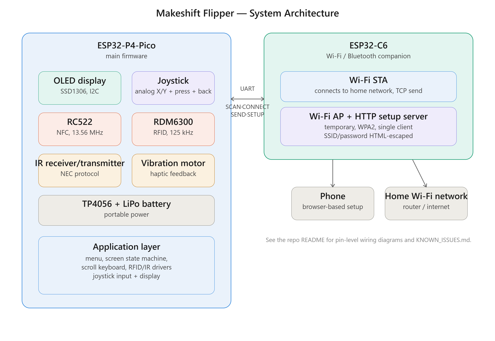

# Makeshift Flipper — firmware skeleton

A DIY Flipper Zero-style multi-tool built on an ESP32-P4-Pico, running
ESP-IDF (not Arduino). OLED display, RFID/NFC, IR transceiver, and a
companion ESP32-C6 for Wi-Fi, all driven by a 2-axis analog joystick
plus a separate BACK button.



## What this can do

- Read 125kHz RFID tags (EM4100 via RDM6300) and 13.56MHz NFC UIDs
  (Mifare via RC522), with haptic feedback on a successful scan
- Receive and transmit infrared remote codes (NEC protocol), plus coarse
  4-receiver direction finding to tell roughly which way a remote is
  pointed (see `main/ir/ir_direction.c` — needs 4x VS1838B modules, not
  built or tested on real hardware yet)
- Scan and connect to Wi-Fi networks through a companion ESP32-C6 radio,
  either via a phone-based web setup flow or a fully offline
  joystick-driven "scroll keyboard"
- Animated OLED menu navigation (slide-in entrance, inverted selection bar)
- "Ask AI": type a question on the scroll keyboard and get an answer from a
  Turkish-capable LLM (Qwen2.5) running on a PC on the same network, via the
  C6's Wi-Fi — see `c6-firmware/README.md`'s "AI bridge" section for the
  one-time Ollama setup this needs

None of this has been built or flashed on real hardware yet — see
"Known issues / security notes" below and `KNOWN_ISSUES.md` for the full
list of what's verified vs. still assumed.

## Pin plan (matches the `#define`s at the top of `main/input/buttons.c`
and `main/ui/display.c`)

| Signal          | GPIO   | Target            |
|-----------------|--------|------------------|
| 3V3, GND        | —      | OLED, joystick common GND |
| SDA             | GPIO7  | OLED (I2C)       |
| SCL             | GPIO8  | OLED (I2C)       |
| Joystick VRx (X axis, ADC1) | GPIO3 | 2-axis analog joystick module |
| Joystick VRy (Y axis, ADC1) | GPIO4 | 2-axis analog joystick module |
| Joystick SW (center press) | GPIO22 | 2-axis analog joystick module |
| BACK button, standalone | GPIO23 | Extra digital button |
| SPI: CS=9, SCK=10, MOSI=11, MISO=12, RST=13 | — | RC522 (13.56MHz) |
| RX              | GPIO17 | RDM6300 (125kHz) |
| 5V/GND          | —      | LiPo + TP4056 (power input, not software-relevant) |
| TX/RX           | GPIO18/19 | ESP32-C6 (companion radio, UART link) |
| GPIO (via transistor) | GPIO20 | Vibration motor |
| RX (RMT)        | GPIO1  | VS1838B IR receiver |
| TX (RMT, via transistor) | GPIO2 | IR LED transmitter |
| RX (RMT)        | GPIO5  | VS1838B #2, direction find: North |
| RX (RMT)        | GPIO6  | VS1838B #3, direction find: East |
| RX (RMT)        | GPIO14 | VS1838B #4, direction find: South |
| RX (RMT)        | GPIO15 | VS1838B #5, direction find: West |

The IR pins (GPIO1/2) weren't in the original wiring diagram — they were
picked from free pins. Wire to match, or change `IR_RX_GPIO`/`IR_TX_GPIO`
at the top of `main/ir/ir_driver.c` to your own preference. The 4 extra
direction-finding receivers (GPIO5/6/14/15) are likewise picked from free
pins — change the `GPIO_NORTH`/`GPIO_EAST`/`GPIO_SOUTH`/`GPIO_WEST`
defines at the top of `main/ir/ir_direction.c` if your wiring differs.
These are on top of, not instead of, the single receiver on GPIO1 — the
two modules are independent and don't share hardware.

**Joystick hardware note:** the original plan assumed a 5-pin digital
joystick; the actual hardware is a **2-axis analog joystick module**
(X/Y potentiometer + center button + power LED). Since ADC1 channels on
the ESP32-P4 only live on GPIO0-6 (GPIO0/1/2 are already taken, GPIO7/8
are the OLED), X/Y landed on **GPIO3/GPIO4** — picked from free pins,
wire to match or change the `JOY_X_ADC_CHANNEL`/`JOY_Y_ADC_CHANNEL`
defines at the top of `main/input/buttons.c`. The center button (SW)
stayed on GPIO22. A **separate physical BACK button** was also added
(GPIO23) — the analog joystick's X axis is now used purely for
left/right navigation within a menu, while exiting a screen is this
standalone button's job.

Joystick axis reading: each axis is calibrated at boot (average of 16
samples, since the rest point isn't guaranteed to be dead center), a
direction event fires once a reading strays 3/8 of the way from center
toward an extreme, and it won't re-arm until back within 1/8 of center
(hysteresis, for "button-like" behavior instead of jitter).

OLED: assumes SSD1306 at I2C address 0x3C (the default on most 0.96"
modules).

## Menu navigation (Flipper Zero style)

The menu is a small tree, not one flat list: the top level is a set of
categories (**RFID / NFC**, **Infrared**, **WiFi**, plus the leaf items
**Ask AI** and **About**), and each category opens its own flat submenu
(e.g. **Infrared** → "IR Send Test" / "IR Direction Find"). See
`main/ui/menu.c`/`menu.h` — `menu_link_submenu()` wires a category item
to its child menu at startup (`main/main.c`'s `app_main()`), and
`menu_handle_button()` walks that tree.

- **Up/Down** (joystick Y axis): moves the cursor
- **Right** (joystick X axis) or **center press**: on a leaf item,
  activates it (both do the same thing); on a category item, enters its
  submenu
- **Left** (joystick X axis): backs out to the parent menu (a no-op at
  the top level, which has no parent)
- **BACK (separate physical button)**: exits whatever screen/action is
  active (a scan screen, IR direction find, the scroll keyboard, ...)
  straight back to the menu it was launched from — this is a different
  thing from LEFT, which only moves within the menu tree itself and
  never touches an active screen

Note the distinction: LEFT never exits a screen, and BACK never moves
between menu levels — they don't overlap.

## Visuals: menu animations

- On entry, the list slides in from the right with ease-out easing (a
  slight per-row stagger/cascade, no float math needed by hand)
- The selected row is highlighted as an inverted (filled, color-swapped)
  bar
- Implemented in `main/ui/menu.c`'s `menu_animate_tick()` and
  `main/ui/display.c`'s `display_draw_text_px(..., invert)` /
  `display_fill_rect()` — start there if you want to add more animations

## Building (ESP-IDF isn't installed on this machine — run this in your
own environment)

```
# Requires ESP-IDF v5.3+ installed and exported (idf.py on PATH)
idf.py set-target esp32p4
idf.py reconfigure   # pulls the esp_lcd_ssd1306 dependency from idf_component.yml
idf.py build
idf.py -p COMx flash monitor
```

## IR module (NEC protocol)

- `main/ir/ir_nec.c` — pure C, hardware-independent NEC encoder/decoder.
  Takes/produces a raw mark/space (microsecond) sequence, has no RMT
  dependency, so it's testable on its own.
- `main/ir/ir_driver.c` — sets up the RMT RX/TX channels, feeds raw
  symbols from the VS1838B into `ir_nec_decode`, and sends
  `ir_nec_encode`'s output out the IR LED on a 38kHz carrier.
- The menu's "IR Send Test" sends a fixed NEC code (addr=0x00, cmd=0x45);
  incoming codes are continuously logged in the background
  (`ir_driver_poll_rx`, in `main.c`'s main loop).
- `main/ir/ir_direction.c` — coarse direction finding using 4 independent
  VS1838B receivers (GPIO5/6/14/15, one per compass point), each running
  its own RMT RX channel and the same `ir_nec_decode()` used by the
  single-receiver driver. `ir_direction_poll()` reports which
  receiver(s) caught a given transmission as a 4-bit flag set (usually
  one, sometimes two adjacent ones for a source near the boundary
  between them) — this is quadrant-level sensing from a wide acceptance
  cone, not a precise bearing angle. Reachable from the menu as "IR
  Direction Find" (under **Infrared**), which shows the live N/E/S/W
  flags and the last decoded frame. Needs the 4-receiver hardware wired
  up and hasn't been tested on real hardware yet.

## RFID modules

- `main/rfid/rc522.c` — MFRC522 SPI driver. Reads a card UID via the
  REQA + anticollision flow; `rc522_read_uid()` returns a
  `rc522_scan_result_t` (`NO_CARD`/`OK`/`UNSUPPORTED_UID`/`ERROR`).
  Currently only **4-byte (single-size) UIDs** are supported — 7/10-byte
  UIDs (cascade tag `0x88`) are detected and reported distinctly as
  `UNSUPPORTED_UID` (not confused with "no card"/error), but their full
  UID isn't read. Sector read/write (Mifare Classic auth, for cloning)
  isn't implemented either — UID read only. The antenna is only powered
  on while the "13.56MHz" scan screen is active, to save power
  (`rc522_antenna_on()`/`rc522_antenna_off()`, called from `main.c`).
- `main/rfid/rdm6300.c` — RDM6300 UART driver, genuinely non-blocking
  (reads whatever bytes are ready from the UART FIFO with a 0 timeout,
  carrying partial-frame state across poll calls if a frame spans more
  than one). Read-only module; the tag itself streams a 14-byte ASCII
  frame (STX + 10 hex digits + checksum + ETX), which is checksum-verified
  and reduced to a 5-byte EM4100 ID.
- `main/feedback/vibration.c` — drives a vibration motor via GPIO20, an
  80ms pulse fires on a successful read.
- The menu's "Read 125kHz" / "Read 13.56MHz" now open a real scan
  screen: it polls continuously, shows the UID and vibrates once a tag
  is found, and **BACK** returns to the menu (also turns the antenna off
  when leaving the RC522 screen).

## ESP32-C6 link (Wi-Fi companion radio)

**This project contains two separate ESP-IDF firmware builds:**

- `main/` — this main firmware, running on the P4
- `c6-firmware/` — a fully separate project running on the C6 (its own
  `idf.py build`, its own flash). See `c6-firmware/README.md`.

They talk over GPIO18/19 with a simple line-based UART protocol:

```
P4 -> C6: SCAN                          C6 -> P4: NET:<ssid>,<rssi> (x N), then SCANDONE
P4 -> C6: CONNECT:<ssid>,<password>     C6 -> P4: OK or FAIL
P4 -> C6: SEND:<ip>:<port>:<data>       C6 -> P4: SENT or FAIL
P4 -> C6: SETUP                         C6 -> P4: OK or FAIL (can take minutes)
```

- P4 side: `main/net/c6_link.c` — every command is blocking (synchronous),
  waiting for a reply (8s timeout for SCAN/CONNECT, 6 minutes for SETUP)
- C6 side: `c6-firmware/main/wifi_commands.c` — scans/connects using
  `esp_wifi` in STA mode; `SEND` opens and closes a new TCP connection
  each time (no persistent socket)
- The menu's "WiFi Scan Test" just logs the networks it finds — there's
  no real "pick a network and connect" screen for it yet

## Wi-Fi setup (entering a password) — web-based, no keyboard/camera needed

The device has no physical keyboard, and typing a password with the
joystick would be painfully slow, so it borrows the same first-time-setup
pattern most routers use:

1. Select **"WiFi Setup"** from the menu
2. The C6 opens a temporary Wi-Fi network named `MakeshiftFlipper-Setup`,
   WPA2-protected (password shown on the OLED) and limited to a single
   simultaneous client (AP+STA dual mode —
   `c6-firmware/main/wifi_setup_ap.c`). The password and single-client
   limit exist to reduce the risk of someone else joining the setup
   network and sniffing the request that carries your real Wi-Fi
   password (see "Known issues / security notes" below for the full
   picture — this is a mitigation, not a complete fix)
3. The user connects their phone to that network and opens
   `192.168.4.1` in a browser
4. A simple HTML page (no external libraries/JS) shows the scanned
   networks as a dropdown; the user picks one, enters the password, and
   submits
5. The C6 takes the form data, attempts to connect as an STA, and
   reports the result back to the P4 as `OK`/`FAIL`; the OLED shows the
   outcome
6. The AP and HTTP server shut down once the connection succeeds, or
   after a 5-minute internal C6 timeout (the P4 side waits up to 6
   minutes)

The P4's main loop **blocks** during this flow (joystick/menu don't
respond) — `action_wifi_setup()` just waits for any keypress once it's
done. This is a deliberate simplification; a non-blocking "setup in
progress" screen could be built as its own task/state machine if needed.

**Note:** a QR-code / camera module alternative was considered but
dropped — it would need extra hardware (a camera), extra cost, and image
processing / QR decode software (which would have been the single most
complex piece of the whole project). The web-based flow gets the same
result with zero extra hardware.

## Wi-Fi setup — no-phone fallback (joystick "scroll keyboard")

For when a phone isn't handy, or web setup isn't wanted, there's a
second, fully self-contained method that only uses the device's own
joystick: **"WiFi Setup Manual"** from the menu.

1. Networks are scanned via the C6 (same `SCAN` command)
2. Results are listed on the OLED; **Up/Down** picks a network, **Press**
   confirms, **BACK** cancels
3. The selected network's password is entered with the joystick-driven
   "scroll keyboard" in `main/ui/text_entry.c`: a 10x6 letter/digit grid
   navigated with **Up/Down/Left/Right**, **Press** adds a character.
   Special cells: `^` = confirm/submit, `<` = backspace, `*` = clear all
4. On confirm, a `CONNECT:<ssid>,<password>` command is sent to the C6
   and the result is shown on the OLED

Like the web setup flow, this screen is fully blocking — nothing else on
the device works until it's done. The scroll keyboard was written as a
general-purpose component (`text_entry_t`) and can be reused anywhere
else text entry is needed later (e.g. naming a saved IR code).

## What currently works

- An animated, joystick-driven OLED menu, organized as a category tree
  (RFID/NFC, Infrared, WiFi, plus Ask AI/About) rather than one flat list
- Buttons (joystick directions) are debounced
- IR receive (logs incoming codes) and transmit (test code) over NEC
- IR direction finding (4-receiver quadrant sensing) is implemented and
  wired into the menu, pending the 4-receiver hardware and a real test
- RC522 (13.56MHz, 4-byte UIDs only) and RDM6300 (125kHz) are wired to
  real scan screens, with haptic feedback
- The P4 ↔ C6 UART protocol is implemented end to end
  (SCAN/CONNECT/SEND/SETUP/ASK), with real Wi-Fi operations on the C6 side
- Web-based Wi-Fi setup (phone → AP → browser → ssid/password form) is
  implemented end to end, reachable from the menu as "WiFi Setup"
- No-phone fallback: joystick "scroll keyboard" for picking a network and
  typing a password ("WiFi Setup Manual")
- "Ask AI": type a question, get a scrollable answer back from a PC-hosted
  Ollama LLM over the C6's Wi-Fi link — needs the one-time PC-side Ollama
  setup in `c6-firmware/README.md`
- "About" still just logs (no real screen yet)

## Next steps (not yet written)

1. RC522: full read support for 7/10-byte UIDs (cascade level 2/3) and
   Mifare Classic sector read/write (the auth flow needed for cloning)
2. Replace `action_wifi_setup()`'s blocking wait loop with a background
   "setup in progress" state that doesn't block the joystick from
   interacting with other screens (optional improvement)
3. IR: a screen for saving/listing received codes (currently log-only)
4. IR direction finding: wire up the 4x VS1838B receivers on
   GPIO5/6/14/15 (see the pin plan above) and verify `ir_direction.c` on
   real hardware — the quadrant flags and acceptance-cone overlap
   behavior are unverified assumptions until then
5. On the C6 side, `c6-firmware/main/uart_link.c`'s GPIO6/7 assumption
   needs checking against your actual wiring (the P4 side is fixed at
   GPIO18/19; the C6 side depends on your board)
6. None of these firmware builds have been compiled or tested on real
   hardware yet — expect to revisit register addresses, timing
   tolerances, and pin assumptions on the first build/flash attempt
7. The analog joystick's X/Y wiring (which pin goes to VRx/VRy) needs
   physical verification — if the axes read backwards, swap the
   `BUTTON_LEFT/RIGHT`/`BUTTON_UP/DOWN` mapping given to X/Y inside
   `buttons_poll()` in `main/input/buttons.c`
8. The threshold/hysteresis constants (`THRESHOLD_FRACTION_*`,
   `RELEASE_FRACTION_*` in `buttons.c`) will need tuning on real
   hardware — depending on the potentiometer's noise floor and mechanical
   play, they could end up too sensitive (false triggers) or too strict
   (missing light touches)
9. "Ask AI" needs a real IP address (`OLLAMA_HOST` in
   `c6-firmware/main/wifi_commands.c`) and a running Ollama instance to do
   anything — see `c6-firmware/README.md`'s "AI bridge" section
10. On-device offline speech-to-command (TinyML keyword spotting for
    Turkish digits/commands via a microphone) is a separate, not-yet-started
    piece — would need new hardware (I2S mic), a new pin, an
    `esp-tflite-micro` integration, and a trained `.tflite` model (that
    training happens off-device, in Python, not on the ESP32 itself)

## Known issues / security notes

This project went through several rounds of adversarial code review
(two parallel Claude sessions deliberately looking for bugs and security
issues in each other's — and their own — work). The full record is in
`KNOWN_ISSUES.md`, including what was fixed, what was accepted as a
low-severity risk (with reasoning), and what's still unverified pending
a real hardware test.

**Headline points, since this repo is public:**

- The Wi-Fi setup AP uses a **fixed, hardcoded password** baked into the
  firmware source — and since this repo is public, that password is
  visible in plain text to anyone reading the code, not just someone
  decompiling a built firmware image. **If you build this device, change
  `AP_PASSWORD` in `c6-firmware/main/wifi_setup_ap.c` (and the copy
  shown in `main/main.c`) before relying on it for anything.**
- The Wi-Fi setup flow is **plain HTTP, no TLS** — the setup AP is
  limited to a single simultaneous client specifically to reduce the
  window for a second device to join and sniff the request that carries
  your home Wi-Fi password, but this is not a substitute for real
  transport security.
- There's **no checksum/CRC on the P4↔C6 UART link** — accepted as a
  low risk for a short, direct wired connection, but worth knowing if
  you extend that link.
- **No firmware in this repo has been built or run on real hardware** —
  all of the above (and everything in `KNOWN_ISSUES.md`) is the result
  of static review, not a verified test.
