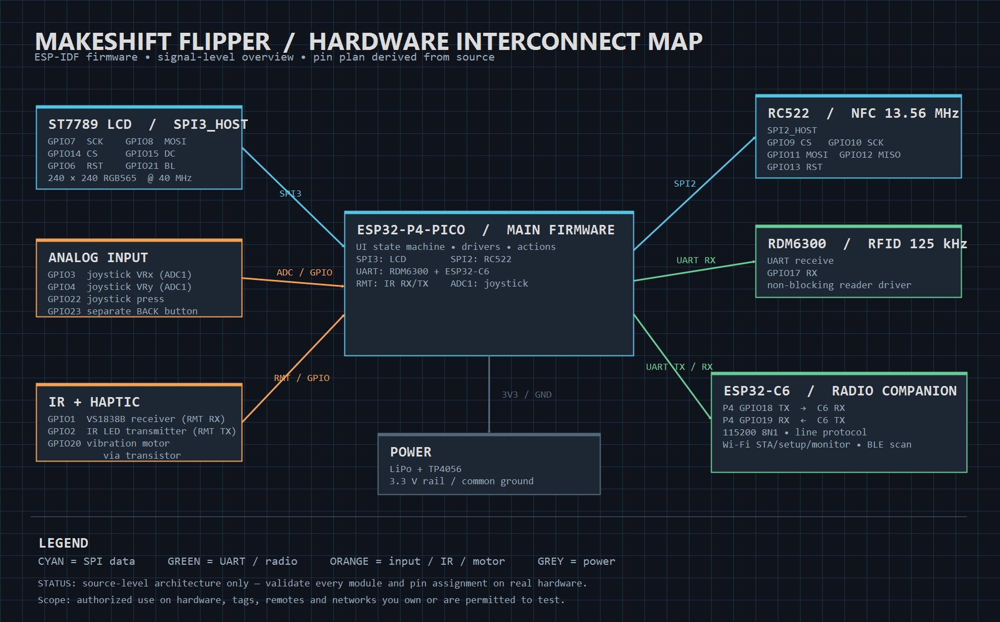

# Makeshifter-Emag

An open, two-MCU handheld for authorized, local hardware experiments. The
main MCU runs the interface and peripheral logic; an ESP32-C6 provides
Wi-Fi and passive Bluetooth Low Energy discovery.

> **Responsibility disclaimer:** The hardware and firmware in this
> repository are technically capable of more than the intended, authorized
> uses described below — that is true of any RFID reader, IR transceiver,
> or Wi-Fi/BLE radio, and no firmware control can fully prevent someone
> from repurposing what they hold in their hands. Nothing here grants
> permission to act beyond what the law and the target's owner allow. If
> you use this device — or code derived from it — to read, clone,
> transmit, or monitor something you do not own or are not explicitly
> authorized to test, that is your action and your legal responsibility
> alone. Neither the author(s) of this project nor any state or authority
> approves, endorses, or is responsible for unauthorized or unlawful use;
> building or owning this device does not authorize anything it is
> technically able to do.

> **Prototype status:** The firmware has CI builds and host-side logic tests,
> but the current ST7789 display configuration and the C6 integration still
> require real-hardware validation. Features described below are implemented
> scope, not claims of field-proven operation.

> **Migration in progress:** the main MCU is being moved from ESP32-P4
> (`main/`, ESP-IDF) to a Raspberry Pi Pico / RP2040 (`pico/`, Pico SDK) to
> use the Waveshare Pico-LCD-1.3 display module (built-in digital 5-way
> joystick + 4 buttons, dropping the separate analog joystick). The ESP32-C6
> companion and its UART wire protocol are unchanged by this migration. The
> `main/` ESP32-P4 tree stays intact and buildable throughout; `pico/` is the
> new tree, currently mid-port and not yet hardware-validated. See
> [pico/README.md](pico/README.md) for its status.



## Purpose and boundaries

This project is for devices, cards, remotes, accounts, and networks that you
own or are explicitly authorized to test. It is intentionally designed around
local, consent-based use:

- Wi-Fi monitoring is receive-only; there is no deauthentication, packet
  injection, password capture, or cracking functionality.
- BLE support is passive advertisement discovery only; it does not pair,
  connect, or access GATT data.
- RFID/NFC and IR features must be used only with authorized test targets.
- Camera/OCR, microphone, GPS, Sub-GHz, remote control, and cellular features
  are **not** part of the current firmware.

See the [capability and use-boundary assessment](CAPABILITY_AND_THREAT_ASSESSMENT.md)
for the detailed feature, privacy, safety, and added-component evaluation.

## What this hardware can do — legitimate use vs. what it can be misused for

The right-hand column is not a feature list or how-to; it exists so you
know what to explicitly avoid. Doing any of it without owning the target
or holding the owner's explicit, recorded authorization is on you — see
the disclaimer above and the
[full assessment](CAPABILITY_AND_THREAT_ASSESSMENT.md) for details and
built-in limits.

| Capability | Legitimate, authorized use | Possible with this hardware, but unauthorized/unlawful — do not do this |
| --- | --- | --- |
| 125 kHz RFID (RDM6300) | Reading your own EM4100 tags; lab asset inventory | Reading someone else's access card or fob without their permission |
| 13.56 MHz NFC (RC522) | Inspecting/backing up your own MIFARE Classic test card | Cloning another person's or an organization's access card to gain entry you're not authorized for |
| Infrared (learn + NEC transmit) | Backing up your own remote; home-automation testing | Controlling or disrupting someone else's TV, A/C, or other IR device without consent |
| Wi-Fi scan/monitor (via C6) | Surveying your own network's coverage/channels | Passively logging neighboring networks or devices for tracking or profiling purposes |
| Passive BLE scan (via C6) | Checking your own BLE devices' advertisement visibility | Using nearby device addresses/RSSI to track people's presence or movement |
| Diagnostics / local log export | Keeping your own device's error history for debugging | Exporting or retaining scan/card data about people or networks you have no authorization over |

## Current firmware scope

| Area | Implemented scope | Validation status |
| --- | --- | --- |
| Interface | 240x240 ST7789 color UI, analog joystick navigation, standalone BACK button, error history | Current display wiring needs hardware validation |
| Interface (`pico/`, in progress) | Same UI on a Waveshare Pico-LCD-1.3 (240x240 ST7789), digital 5-way joystick + B=BACK button, built into the display module | Not yet hardware-validated, see [pico/README.md](pico/README.md) |
| RFID/NFC | 125 kHz EM4100 reads; RC522 MIFARE Classic UID read, saved UID library, limited authorized clone flow | Hardware validation pending |
| Infrared | NEC receive, learn, save, browse, delete, and transmit | Hardware validation pending |
| Wi-Fi | C6-assisted scan, owner-managed setup, passive channel-hopping AP monitor | C6 end-to-end validation pending |
| Bluetooth | Passive BLE advertisement scan | C6 end-to-end validation pending |
| Diagnostics | On-device rolling error history and optional local-LAN export | Hardware/network validation pending |

## Architecture

```text
ESP32-P4 (main/)                         ESP32-C6 (c6-firmware/)
  UI, input, display                       Wi-Fi + passive BLE operations
  RFID/NFC and IR drivers                  Local setup and diagnostics transport
          \                                 /
           \--- UART: P4 GPIO18/19 -------/
```

The two targets are independent ESP-IDF projects. Build and flash each one
separately; see [the C6 README](c6-firmware/README.md) for its commands and
UART protocol.

A Raspberry Pi Pico (RP2040) main-MCU replacement for `main/` is being
built in parallel in [`pico/`](pico/README.md) — same role split (main MCU
handles UI/input/display/RFID/IR, C6 handles Wi-Fi/BLE over the same UART
protocol), different chip and SDK. See that directory's README for pin
plan and current port status.

## Build

Install and export ESP-IDF v5.3.1 or newer, then build the P4 firmware from
the repository root:

```sh
idf.py set-target esp32p4
idf.py build
idf.py -p COMx flash monitor
```

Build the companion C6 firmware separately:

```sh
cd c6-firmware
idf.py set-target esp32c6
idf.py build
```

CI builds both firmware targets and runs host-side unit tests on every push
and pull request. The host suite can also be run locally in a Bash/GCC-capable
environment:

```sh
bash tests/run_tests.sh
```

## Hardware and validation

The pin assignments, expected behavior, and validation order are intentionally
kept outside this overview:

- [Hardware test matrix](HARDWARE_TEST_MATRIX.md) — the checkable real-device
  verification list.
- [Hardware integration plan](HARDWARE_INTEGRATION_PLAN.md) — future camera
  and constrained voice-command integration analysis; neither is implemented.
- [Known issues](KNOWN_ISSUES.md) — confirmed fixes, open risks, and items
  awaiting real-hardware evidence.

Do not mark a feature as working until it has passed the relevant row in the
hardware test matrix.

## Repository map

| Path | Role |
| --- | --- |
| `main/` | ESP32-P4 firmware: UI, input, RFID/NFC, IR, diagnostics, and C6 link |
| `pico/` | Raspberry Pi Pico (RP2040) port of `main/`, in progress — see [pico/README.md](pico/README.md) |
| `c6-firmware/` | ESP32-C6 companion firmware: Wi-Fi and passive BLE work (unchanged by the Pico migration) |
| `tests/` | Hardware-independent host tests for parsers, storage libraries, UI entry, and diagnostics |
| `.github/workflows/build.yml` | CI for both ESP-IDF targets and the host tests |
| `HARDWARE_TEST_MATRIX.md` | Hardware acceptance checklist |
| `CAPABILITY_AND_THREAT_ASSESSMENT.md` | Capability, use-boundary, privacy, and added-component assessment |
| `SHARING.md` | Accurate, safe project-sharing checklist and post drafts |

## Project hygiene

OCR and ASR data, models, training reports, and virtual environments belong to
their dedicated research repositories, not to this firmware repository. The
root `.gitignore` excludes those local experiment directories so firmware
history and GitHub releases stay small, reproducible, and reviewable.

## Sharing the project

Use [SHARING.md](SHARING.md) after a real-device demonstration is available.
Until then, keep the prototype-status notice above and do not represent the
technical overview image as a hardware demo.
