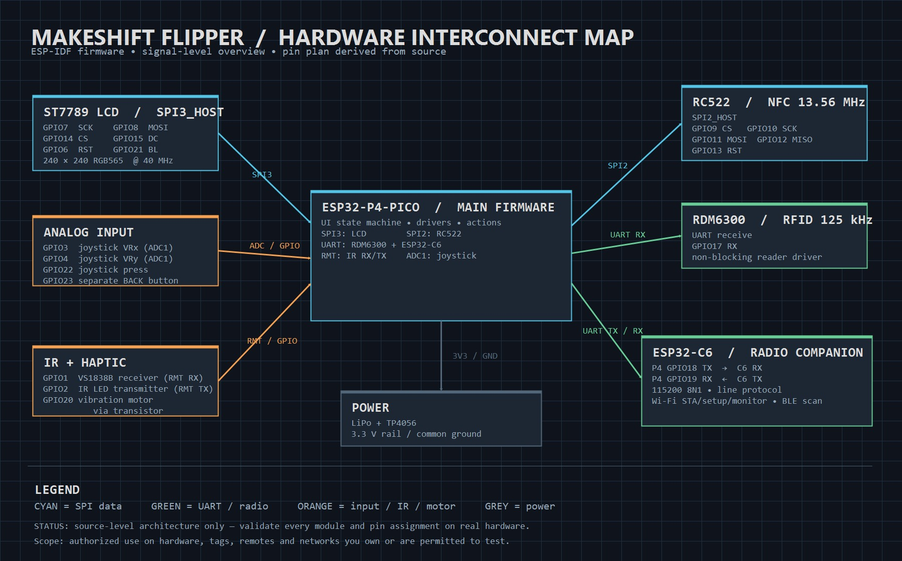

# Makeshift Flipper

An ESP32-C6 handheld firmware project for experiments on equipment you own or
are explicitly authorized to test. One C6 runs the display, controls and
on-chip Wi-Fi/BLE; there is no ESP32-P4 companion or inter-MCU UART link.

> **Working prototype, not a finished multi-tool.** The display/control
> firmware runs on real ESP32-C6 hardware: display, buttons, menus, the boot
> splash and the on-chip Wi-Fi and BLE features (scan, AP, monitor, channel
> map, frame stats, probe capture, BLE scan/radar, and the combined BLE+probe
> radar) have been built, flashed and used on the device. The RFID readers, IR
> hardware, vibration/buzzer motor and battery gauge have **not** been
> validated as an assembled device. A menu item or compiled driver is not proof
> that its external module is connected or working. See
> [hardware checks](HARDWARE_TEST_MATRIX.md).

> **Authorization matters.** Use the radio, RFID and IR functions only on
> devices and networks you own or have explicit permission to test. The
> Hacking menu is a grouping for passive observation, not permission to
> interfere with other devices. You are responsible for your own use.



The diagram is a **target concept**, not an as-built wiring diagram. In
particular, do not wire the RC522, motor or LiPo from it. The current pin
profile and conflicts are described below.

## What the current firmware exposes

The device UI is in Turkish; the tables below give each menu and item an
English translation. The main menu has eight sections: **RFID / NFC**,
**Kızılötesi** (Infrared), **WiFi**, **Bluetooth**, **SecLab**, **Hacking**,
**Hatalar** (Errors) and **Hakkında** (About). Each menu item's exact on-screen
label is in [`main/main.c`](main/main.c).

| Menu | Items (label — meaning) | Current software behavior | Validation boundary |
| --- | --- | --- | --- |
| RFID / NFC | 125kHz Oku (read) · 13.56MHz Oku (read) · 13.56MHz Kopyala (clone) · 125kHz Kaydet (save) · 13.56MHz Kaydet (save) · RFID Kütüphanesi (library) | 125 kHz RDM6300 reading and saved-tag library; 13.56 MHz RC522 read/save/limited MIFARE Classic clone workflow in source | External readers not validated. RC522 initialization is disabled in the current screen-only profile. Do not expect its menu actions to work. |
| Kızılötesi (Infrared) | IR Gönderim Testi (send test) · IR Öğren (learn) · IR Kütüphanesi (library) · IR Yön Bul (Yok) (direction-find — unavailable) | NEC send, receive/learn and saved-code library | IR receiver and LED driver need physical testing. “IR Yön Bul (Yok)” explicitly reports itself unavailable. |
| WiFi | WiFi Tara/Bağlan (scan/connect) · WiFi Durum (status) · WiFi Ağım (my AP) | Scan (sorted nearest-first), manual station connection/status, a local WPA2 access point (“WiFi Ağım” = *my network*) with a Wi-Fi-join QR code | STA status does not prove Internet access or reveal the router's client count. 2.4 GHz only (the C6 has no 5 GHz radio), so 5 GHz networks/hotspots never appear. |
| Bluetooth | BT Tara (scan) · BLE Radar | Active BLE scan with a device list (named-first, then nearest-first), a best-effort device-kind guess, iBeacon/Eddystone decoding, a privacy view (address type + manufacturer/company-ID), and **BLE Radar** direction/range mapping | No pairing, manual connection or GATT access. Active scan emits scan-request packets (like a phone). Radar bearings/distances are coarse RSSI estimates, not exact meters/degrees. |
| SecLab | Güvenli Kullanım (safe use) | Authorized-use guidance | Informational screen only. |
| Hacking | WiFi İzleme (monitor) · Kanal Haritası (channel map) · Çerçeve İstat (frame stats) · Probe Yakala (probe capture) · WiFi Radar · BLE Keşif (discovery) · Birleşik Radar (combined radar) | Receive-only Wi-Fi monitor, channel-occupancy map, 802.11 frame-type stats, probe-request capture, **WiFi Radar** for nearby access points, a shortcut to passive BLE discovery, and **Birleşik Radar** (a combined BLE + Wi-Fi-probe walk-around radar) | Black background/red lettering. No deauthentication, injection, handshake capture, DoS or Bluetooth disconnection. Weak (OPEN/WEP) APs are flagged in the monitor list. |
| Hatalar / Hakkında (Errors / About) | — | Local error history and device information | No network log upload. About retains the “ErdemFlip” label; the main menu title is “Makeshift Flipper”. |

Across every screen a small **battery gauge** is drawn in the status banner
(percent + a battery glyph), read from an ADC fuel-gauge input; it shows `--`
when no valid battery reading is present (e.g. the sense pin is floating), so a
missing gauge is not an error. Confirmed actions give short **haptic/buzzer
feedback** through the GPIO1 driver, and the radar screens add a sonar-style
expanding-ring animation with an optional audio “ping” whose rate tracks
signal strength. The battery ADC, the buzzer/motor and their wiring are **not**
validated on assembled hardware.

“WiFi Ağım” (*my network*, the local AP) creates a network without an Internet uplink. The C6
shows its SSID, a newly generated 12-character WPA2 password, local IP and
the number of associated clients (maximum four). The default AP network
interface provides DHCP. RIGHT/A starts or stops it; LEFT leaves the screen
without stopping the AP. Reopening the screen shows its current status.
Starting the AP disconnects any STA connection; stopping it restores STA
mode but does not reconnect automatically. The password changes on every
new AP start and is not logged or saved in flash. There is **no** Internet
sharing, captive portal, HTTP server or file-transfer service yet: joining
the network alone does not transfer files. USB-C currently serves
power/flashing/serial diagnostics, not an implemented data-export workflow.

While the AP is running, UP shows a Wi-Fi-join **QR code** (the standard
`WIFI:` payload) so a phone can join by scanning instead of typing the
password.

Wi-Fi monitoring disconnects the station connection, hops channels 1–13 and
cannot run alongside the local AP, a normal scan/connect or BLE discovery in
this firmware. The local AP also blocks these other radio actions until it
is stopped.
Stopping the monitor does not automatically reconnect to the previous Wi-Fi
network. BLE discovery is passive; the list is not a list of every device on
your Wi-Fi network.

### Passive recon tools (Hacking / Bluetooth)

All of these are receive-only: they read what devices already broadcast over
the air and transmit nothing (the one exception is the BLE **active** scan,
which emits small scan-request packets, exactly as a phone does when listing
nearby devices). All Wi-Fi tools here use the same channel-hopping monitor
and see every nearby 2.4 GHz network, not just one.

- **Channel map (Kanal Haritası):** per-channel (1–13) occupancy bar chart —
  how many APs are on each channel and the strongest signal — for picking a
  clear channel for your own router.
- **Frame stats (Çerçeve İstat):** running tally of 802.11 frame types
  (beacon / probe / data / control) seen, as an activity/traffic overview.
- **Probe capture (Probe Yakala):** distinct SSIDs that nearby client
  devices ask for in probe requests, with a sighting count. Useful for
  seeing what network names your own devices leak. No device addresses are
  stored.
- **BLE Radar:** locates BLE devices around you without extra hardware. You
  calibrate bearings with one timed 360° turn (mark start/end with RIGHT),
  after which distances update live from smoothed RSSI as you move; targets
  are ordered nearest-first. Bearings assume a steady turn; it is a coarse
  estimate, not an exact fix.
- **WiFi Radar (Hacking menu):** the same direction/range technique applied to
  nearby Wi-Fi access points instead of BLE devices, built on the same
  channel-hopping monitor as the other Hacking tools. One timed 360° turn
  fixes each AP's bearing; live RSSI (smoothed) updates its distance as you
  move. Same coarse-estimate caveats as BLE Radar.
- **Combined radar (Birleşik Radar):** plots BLE devices *and* the Wi-Fi
  devices sending probe requests on one screen at once, time-slicing the single
  radio between the two (the C6 cannot listen on both simultaneously). It is a
  "hot/cold" **walk-around** finder: each blip's distance from the centre
  follows its smoothed RSSI, so as you walk a target slides in as you approach
  and out as you retreat; the selected target shows a closer/farther trend and
  a metal-detector-style beep that speeds up the nearer you get. When a BLE
  device and a probing device are close in *both* signal and on-screen
  position, they are correlated (nearest match, not the first within a window),
  drawn with a connecting line and a small "match" ripple — a guess that the
  same physical device is doing both. Pressing **A** opens a full detail page
  for the selected target (MAC, name/asked-for SSID, signal, and the
  correlated device's probes). Correlation is a heuristic; MAC randomization on
  modern phones means many devices never correlate. The on-screen angle is a
  stable per-device spread for readability, **not** a compass bearing.

Camera/OCR, microphone/voice control, GPS, Sub-GHz, cellular and general
remote-control features are not part of the current firmware. For a broader
capability and misuse-boundary discussion, see
[CAPABILITY_AND_THREAT_ASSESSMENT.md](CAPABILITY_AND_THREAT_ASSESSMENT.md).

## Current hardware profile

The board is a Waveshare **ESP32-C6-DEV-KIT-NX**. Its header breaks out
GND/TXD/RXD/3V3/RST/5V plus IO0-IO13, IO15 and IO18-IO23. There is no GPIO14
pin. The TXD/RXD pins are GPIO16/GPIO17 (UART0, wired to the on-board CH343
USB-serial chip), so they are not free for peripherals.

**Pins to keep free of external wiring:**

- **GPIO12/GPIO13** are the C6's native USB D-/D+ lines. Using GPIO13 for
  joystick UP disabled the native USB port and produced 4-5 phantom UP
  presses per real press. A longer debounce did not help.
- **GPIO4, GPIO5, GPIO8, GPIO9 and GPIO15** are strapping pins. Only
  inputs whose source idles high or high-Z are placed on the free ones, so
  no module can pull a strap pin low at reset.

The active settings are in [`main/hardware_profile.h`](main/hardware_profile.h).
After the LCD and controls, exactly seven header pins are free (0, 1, 2, 4,
5, 7, 15), and the planned modules need seven signals. The soldering
reference is [WIRING_MAP_RC522.md](WIRING_MAP_RC522.md).

| Firmware assignment | ESP32-C6 GPIO | Wired? |
| --- | ---: | --- |
| ST7789 SCK / MOSI / CS / DC / RST / backlight | 18 / 19 / 9 / 8 / 20 / 21 | Yes |
| Joystick UP / DOWN / LEFT / RIGHT | 6 / 11 / 23 / 22 | Yes |
| A button / B button | 10 / disabled | Yes / no |
| Battery sense (ADC1_CH3, via a 2:1 divider) | 3 | Sense wiring unverified |
| RC522 SCK / MOSI (shared with LCD) | 18 / 19 | No |
| RC522 MISO / CS / RST | 5 / 7 / 2 | No |
| RDM6300 TX (through a 5 V-to-3.3 V level shifter) | 15 | No |
| IR receiver (VS1838B) / IR LED driver | 4 / 0 | No |
| Buzzer / vibration driver | 1 | Buzzer bench-tested |

Ordinary menus use UP/DOWN to move, RIGHT or A to select and LEFT to go back.
On the text keyboard, a short LEFT/RIGHT moves horizontally, a long LEFT
exits, a long RIGHT selects, and A selects immediately. On the combined radar,
RIGHT selects the next target, a short LEFT the previous one, a long LEFT
exits, and A opens the selected target's detail page. GPIO3 (the old centre
press) is now used for the battery ADC, so the current control scheme is
one-handed without a centre button.

`BOARD_HAS_RC522` is `0` until the reader is wired. Connecting it does not
enable it on its own. Do not power an RC522 from 5 V. RC522, RDM6300, IR and
the motor are unverified on real hardware. The old TCA9554 button map in
[C6_STANDALONE_HARDWARE_PLAN.md](C6_STANDALONE_HARDWARE_PLAN.md) is historical
and **does not describe the current direct-GPIO build**. Use the source and
[HARDWARE_TEST_MATRIX.md](HARDWARE_TEST_MATRIX.md) before changing wires.

## Build, flash and tests

The project targets `esp32c6`, 4 MB flash and the custom
[`partitions.csv`](partitions.csv) layout. The current build was verified
with ESP-IDF 5.3.x on Windows. From an exported ESP-IDF shell:

```sh
idf.py build
idf.py -p COM7 flash
idf.py -p COM7 monitor
```

`COM7` was the verified C6 USB-Serial/JTAG port on one Windows machine;
replace it with **your** device's port. Confirm the chip identity before
flashing if multiple serial devices are attached. If you change the target
or start from a fresh configuration, use `idf.py set-target esp32c6` first.

ESP-IDF's Windows build tools may fail when the checkout path contains
non-ASCII characters. An ASCII-only project copy was used for the latest
build/flash; copy source changes there before building. A successful build
or flash proves neither screen appearance nor every peripheral. Check the
real device with the [test matrix](HARDWARE_TEST_MATRIX.md).

Hardware-independent host tests can be run with Bash and a C compiler:

```sh
bash tests/run_tests.sh
```

The black Hacking-menu change and the new SoftAP code passed the host suite
and ESP-IDF build, were flashed to the C6, and produced serial boot output.
An actual phone/laptop joining the AP and its DHCP/client-count behavior
still need testing.

## Project layout and further reading

| Path | Purpose |
| --- | --- |
| `main/` | ESP32-C6 firmware: UI, direct-GPIO controls, RFID/IR drivers, diagnostics and on-chip radios |
| `main/net/c6_link.c`, `main/net/radio_ble.c` | Station Wi-Fi, local AP, scan/monitor and passive BLE; the `c6_link_*` name is historical, not a UART link |
| `tests/` | Host-side logic tests; not a replacement for hardware testing |
| [HARDWARE_TEST_MATRIX.md](HARDWARE_TEST_MATRIX.md) | Device-level checks and current direct-button map; some older prose may still need reconciliation |
| [C6_STANDALONE_HARDWARE_PLAN.md](C6_STANDALONE_HARDWARE_PLAN.md) | Historical Pico/TCA9554 plan and unassembled power concept; **not** the current button pin map |
| [KNOWN_ISSUES.md](KNOWN_ISSUES.md) | Historical audit notes; some older P4/C6 and “not yet flashed” statements are stale |
| [MCU_ARCHITECTURE_DECISION.md](MCU_ARCHITECTURE_DECISION.md) | Why the field unit moved to one C6 |

The portable LiPo/charger/power-path system has not been validated. Do not
assume a TP4056 alone provides safe simultaneous charging and operation.
Keep the battery build separate from the USB-powered firmware bring-up until
its wiring, protection and current budget are tested.

## License

Code in this repository is released under the [MIT License](LICENSE).
